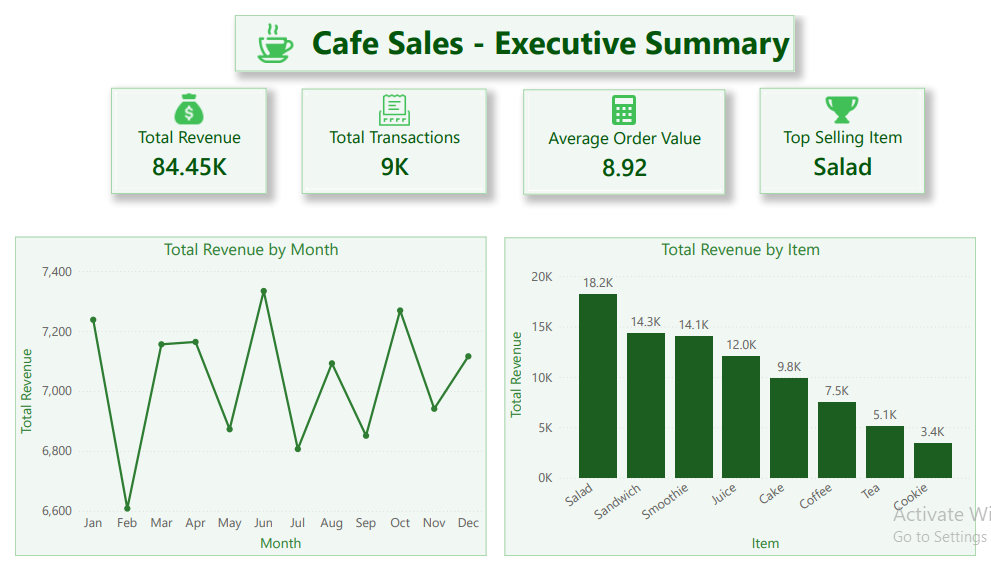
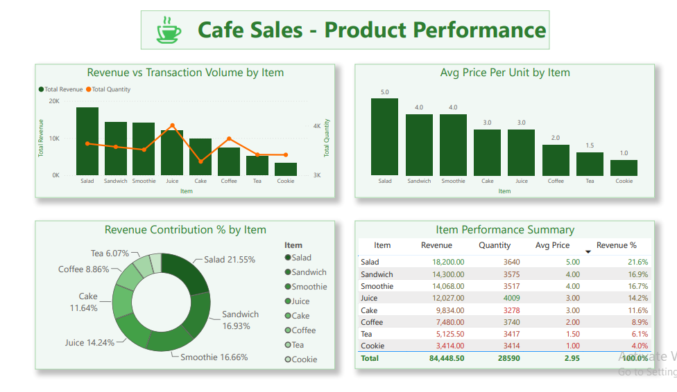
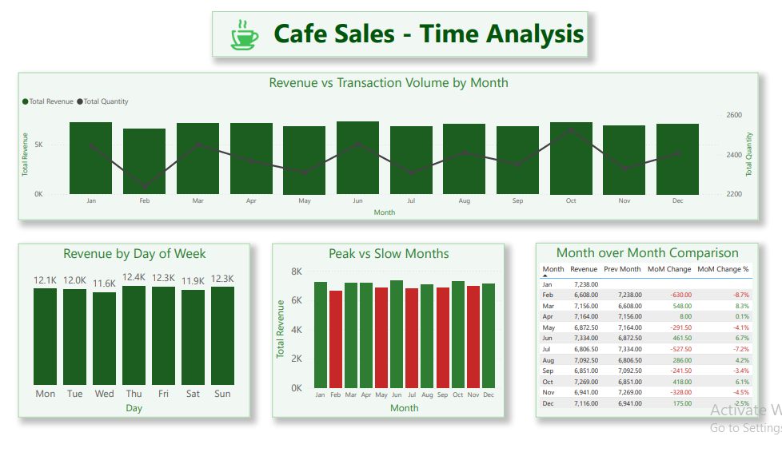
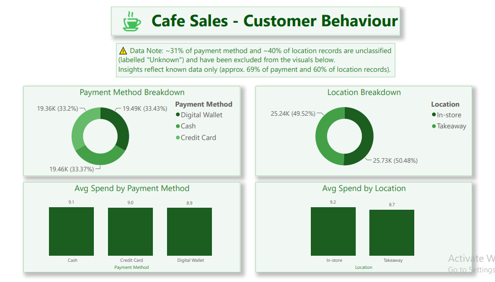

# ☕ Cafe Sales Power BI Dashboard

An interactive, multi-page business intelligence dashboard built in **Power BI Desktop**, analysing cafe sales data across product performance, time trends, and customer behaviour.

---

## 📊 Dashboard Overview

This dashboard transforms cleaned cafe sales transaction data into actionable business insights across **4 report pages**:

| Page | Title | Description |
|---|---|---|
| 1 | Executive Summary | High-level KPIs, revenue trend, and revenue by item |
| 2 | Product Performance | Item-level revenue, quantity, pricing, and contribution analysis |
| 3 | Time Analysis | Monthly trends, day-of-week performance, and MoM comparisons |
| 4 | Customer Behaviour | Payment method and location breakdowns with avg spend analysis |

---

## 🗂️ Dataset

- **Records**: 9,469 cleaned transactions (filtered from 10,000 raw records)
- **Period**: January 2023 — December 2023
- **Columns**: Transaction ID, Item, Quantity, Price Per Unit, Total Spent, Payment Method, Location, Transaction Date

### Data Pipeline
Raw data was preprocessed and explored in a separate repository before being used in this dashboard:

👉 **[Cafe Sales Data Preprocessing & EDA](https://github.com/ZainAli-2001/Cafe-Sales-Data-Preprocessing-EDA)**

That repo covers:
- Handling missing values in Quantity, Price Per Unit, Total Spent, Payment Method, and Location
- Validating Quantity × Price Per Unit = Total Spent
- Exploratory Data Analysis (EDA) — revenue by item, monthly trends, payment/location distributions
- Exporting the final cleaned CSV (9,469 records) used in this dashboard

> ⚠️ **Data Limitation**: Approximately 31% of Payment Method and 40% of Location records are labelled "Unknown" — these have been excluded from the relevant breakdowns on Page 4. All other pages use the full cleaned dataset.

---

## 📁 Repository Structure

```
cafe-sales-powerbi-dashboard/
├── README.md
├── cafe_sales_dashboard.pbix
├── data/
│   └── clean_cafe_sales.csv
└── screenshots/
    ├── page1_executive_summary.png
    ├── page2_product_performance.png
    ├── page3_time_analysis.png
    └── page4_customer_behaviour.png
```

---

## 📸 Dashboard Screenshots

### Page 1 — Executive Summary


### Page 2 — Product Performance


### Page 3 — Time Analysis


### Page 4 — Customer Behaviour


---

## 🔍 Key Insights

- 💰 **Total Revenue**: $84,448.50 across 9,469 transactions
- 🏆 **Top Selling Item**: Salad — highest revenue contributor at 21.6% despite not being the most frequently purchased item
- 📦 **Most Purchased Item**: Juice — highest transaction volume at 4,009 units
- 📅 **Busiest Day**: Thursday consistently generates the highest daily revenue
- 📈 **Peak Months**: June and October recorded the strongest monthly performance
- 📉 **Slowest Month**: February showed the steepest MoM decline (-8.7%)
- 💳 **Payment Methods**: Near-equal split across Digital Wallet, Cash, and Credit Card (~33% each)
- 📍 **Location**: Almost perfectly balanced between In-store (50.48%) and Takeaway (49.52%)
- 🛒 **Average Order Value**: $8.92 — consistent across all payment methods and locations

---

## 🛠️ Tools & Technologies

| Tool | Purpose |
|---|---|
| **Power BI Desktop** | Dashboard development, DAX measures, data modelling |
| **Power Query (M)** | Data type transformation and import |
| **DAX** | KPI measures, time intelligence, MoM calculations, conditional formatting logic |
| **Python (Pandas)** | Data cleaning and EDA (see preprocessing repo) |
| **CSV** | Data source format |

---

## 📐 Data Model

- **Fact Table**: `CleanedCafeSales` — 9,469 transaction records
- **Dimension Table**: `DateTable` — generated via DAX `CALENDAR()` function, marked as official Date table
- **Relationship**: `DateTable[Date]` → `CleanedCafeSales[Transaction Date]` (One-to-Many, Single direction)

---

## 🧮 Key DAX Measures

```dax
Total Revenue = SUM(CleanedCafeSales[Total Spent])

Total Transactions = DISTINCTCOUNT(CleanedCafeSales[Transaction ID])

Average Order Value = DIVIDE([Total Revenue], [Total Transactions])

Revenue Contribution % =
DIVIDE(
    [Total Revenue],
    CALCULATE([Total Revenue], ALL(CleanedCafeSales[Item]))
)

MoM Change % =
IF(
    ISBLANK([Prev Month Revenue]) || [Prev Month Revenue] = 0,
    BLANK(),
    DIVIDE([MoM Change], [Prev Month Revenue])
)
```

---

## 🚀 How to Use

1. Download and install **[Power BI Desktop](https://powerbi.microsoft.com/desktop/)** (free)
2. Clone or download this repository
3. Open `Cafe_Sales_Dashboard.pbix` in Power BI Desktop
4. All data is embedded — no external connection needed
5. Use the **page tabs** at the bottom to navigate between the 4 report pages

---

## 👤 Author

[Zain Ali](https://github.com/ZainAli-2001)

---

## 📄 License

This project is open source and available under the [MIT License](LICENSE).
